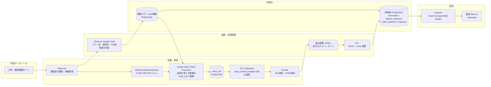

# University Comparison Site

海外大学の学位プログラムを収集し、学位レベル・国・オンライン対応・授業料などの条件で検索できるデータ収集プログラムです。

大学ごとに異なるページ構造と授業料表記を、収集・変換・正規化・検索のパイプラインとして分離しています。単なるスクレイピングではなく、取得できなかった理由やデータの品質も追跡できる構成を目指しています。

## 1. プロジェクト概要

### 背景と目的

大学の公式サイトに分散している学位プログラム情報を横断的に比較できるようにすることが目的です。対象サイトごとに HTML 構造、URL 規則、授業料の単位が異なるため、次の処理を自動化しています。

- 大学・教育機関サイトからの候補 URL 発見
- robots.txt、sitemap、ページ内容を考慮したクロール
- 学位プログラムと授業料情報の抽出
- 年額・月額などの授業料表記の正規化
- PostgreSQL への重複を抑えた格納
- API 経由での条件検索と詳細表示

### 対象ユーザー

- 海外大学の学位プログラムを比較したい学生・社会人
- 大学やコースの候補を条件で絞り込みたい利用者

## 2. アーキテクチャ図

### データフロー



### キューとデータ保持場所

| データ | 保持場所 | 役割 |
| --- | --- | --- |
| 観測対象 URL | `observer/observe_supervisor.py` の設定 | Observer が処理する入力 |
| 観測結果の一時項目 | `InMemoryObserveQueue` | Observer から Searcher へ渡すプロセス内 FIFO キュー |
| クロール対象 URL | PostgreSQL の `seed_urls` | Observer の品質判定後に登録され、ETL Scheduler が `enabled = 1` の URL を読み込む |
| 抽出途中のデータ | `log/extracted_records_*.jsonl` | ETL の入力、再実行時の中間成果物 |
| 実行・エラー情報 | `log/` と PostgreSQL の観測ログテーブル | 取得状況、エラー、品質判定の追跡 |
| 検索用データ | PostgreSQL | 大学、プログラム、授業料、関連付けを正規化して保持 |
| 画面 | `webpage/` | API を呼び出す静的フロントエンド |

現在のキューは `deque` を使ったプロセス内実装です。プロセス終了後も残る外部キューではないため、複数ワーカー間の共有や再配送はまだ行っていません。将来の水平分散では AWS SQS などへの置き換えを検討しています。

通常の ETL 実行では、まず Scheduler が PostgreSQL の `seed_urls` テーブルから `enabled = 1` の `root_url` と探索深度を読み込みます。その URL を Crawler が探索し、抽出結果を `extracted_records_*.jsonl` へ保存します。JSONL は探索対象 URL の入力ではなく、クロール後の抽出結果を ETL の DB 投入ステージへ渡す中間データです。`--skip-crawl` を指定した場合だけ、既存の JSONL を読み込んでクロールを省略します。

## 3. 主要機能

### 収集・探索

- `httpx` を基本とし、必要に応じて `requests` を使うフォールバック
- robots.txt と sitemap を考慮した URL 候補生成
- 同一ドメイン・対象パスの範囲を制御したクロール
- Cloudflare、JavaScript 依存、空ページなど取得不能要因の記録
- 大学名、学位プログラム、コース種別、オンライン可否、授業料の抽出

### ETL・データ品質

- 抽出 JSONL をバッチ単位で読み込み
- `universities`、`degree_programs`、`tuition_patterns`、関連付けテーブルへ変換
- 授業料を元の金額と通貨を保持したまま、比較用の月額値も保存
- 観測ログに対する品質ゲート
  - seed 発見率
  - 致命的エラー率
  - API 使用回数の平均
  - PDF 取得時の致命的エラー

### 検索 API・画面

- キーワード、国、学位レベル、カテゴリ、オンライン対応で絞り込み
- 授業料の種類、通貨、価格帯で絞り込み
- 最終確認日、金額、正規化月額でソート
- ページネーションと任意の総件数取得
- プログラム詳細と授業料履歴の表示
- `/health` による稼働確認

## 4. 技術スタック

| 分類 | 技術 |
| --- | --- |
| 言語 | Python 3.11 |
| API | FastAPI, Uvicorn |
| HTTP・解析 | httpx, requests, BeautifulSoup |
| データ処理 | Python dataclass, JSONL, バッチ ETL |
| データベース | PostgreSQL, psycopg2 |
| フロントエンド | HTML / CSS / JavaScript (`webpage/`) |
| コンテナ | Docker, Docker Compose |
| 実行環境 | Railway 設定、AWS EC2 |
| IaC | Terraform, AWS Provider |
| テスト・品質確認 | pytest、品質ゲートスクリプト |

## 5. 設計上のポイント

### 収集と提供を分離

クローラーと検索 API を同じ処理にせず、収集は JSONL と PostgreSQL へ、提供は読み取り中心の FastAPI へ分離しました。収集処理が遅い場合でも、検索 API の応答に直接影響しにくい構成です。

抽出レコードの JSONL 出力には bounded な `asyncio.Queue` と単一 writer を使用しています。キューが満杯になった場合はクロール側が待機するため、未処理レコードがメモリ上に無制限に蓄積しません。ファイル書き込みは `asyncio.to_thread()` へ移し、イベントループを直接ブロックしないようにしています。書き込みキューの上限は `ETL_RECORD_QUEUE_MAXSIZE`（デフォルト 1000）で変更できます。ETL 終了時にはキューの処理完了を待ってから writer とファイルを閉じます。

### 失敗をデータとして残す

取得失敗を単に捨てず、HTTP エラー、タイムアウト、bot 対策、sitemap 取得失敗などをログ・観測テーブルに残します。次回の対象選定や品質ゲートの判定に利用できます。

### 検索向けに正規化する

大学、学位プログラム、授業料パターンを別テーブルに分け、関連付けテーブルで結合しています。授業料の元データを失わずに、比較用の正規化月額を追加できる設計です。

### API の権限を読み取り専用にする

検索 API は PostgreSQL の読み取り用ロールで接続します。収集・更新処理と検索処理で接続情報と責務を分け、API からの意図しない更新を防ぎます。

### 設定値とコードを分離する

データベース接続情報は `.env`、AWS の環境固有値は `terraform.tfvars` に置き、Git 管理から除外しています。公開用の [`terraform.tfvars.example`](terraform/terraform.tfvars.example) にはプレースホルダーのみを記載しています。

## 6. 規模・実測値

収集対象や実行時間は実行条件によって変わるため、固定値を README に埋め込まず、実行ログから確認できる形にしています。ETL のログには処理レコード数、学位数、チャンク数、DB への投入数が出力されます。

```text
[ETL] Stage 1/3 complete: records=<records> degrees=<degrees>
[ETL] Stage 2/3 complete: chunks=<chunks> records=<records> degrees=<degrees>
[ETL] loaded totals: universities=<n> programs=<n> patterns=<n> maps=<n>
```

Observer は次のカウンタを出力します。

```text
[OBSERVER_PIPELINE] observed=<n> queued=<n> dispatched=<n> transformed=<n> promoted_targets=<n> observe_errors=<n>
```

## 7. 実行方法

### 必要環境

- Python 3.11 以上
- Docker Desktop（Compose を使う場合）
- PostgreSQL 接続先
- 取得対象サイトへアクセスできるネットワーク

### 環境変数

`.env` を作成し、実行する処理に必要な接続情報を設定します。実際のパスワードや DSN はコミットしないでください。API は本番用の `PARENT_DB_*` が設定されていれば優先し、未設定なら開発用の `DB_*` を使用します。

### Python で実行

```powershell
python -m venv .venv
\.venv\Scripts\Activate.ps1
pip install -r requirements.txt

# API
uvicorn search.searcher:app --reload --port 8000

# ETL（収集 -> JSONL変換 -> DB投入）
python -m ETL.ETL

# 前回のJSONLを使って変換・投入する場合
python -m ETL.ETL --skip-crawl

# Observer
python -m observer.observer
```

### Docker Compose で実行

```powershell
docker compose up --build api
docker compose --profile etl run --rm etl
docker compose --profile observe run --rm observe
```

API 起動後は `http://localhost:8000/`、OpenAPI は `http://localhost:8000/docs`、ヘルスチェックは `http://localhost:8000/health` で確認できます。

## 8. Terraform / AWS

Terraform の設定は [`terraform/`](terraform/) にあります。

### Terraform が管理するもの

- AWS EC2 インスタンス
- EC2 用 Security Group
- SSH の許可元 CIDR とアウトバウンドルール
- EC2 の AMI、インスタンスタイプ、サブネット参照

### 既存リソースとして参照するもの

- VPC
- Subnet

VPC 自体や Subnet を Terraform で新規作成するのではなく、ID を変数として受け取って既存ネットワークへ EC2 を配置しています。AWS 環境固有値は [`terraform/terraform.tfvars`](terraform/terraform.tfvars) に置き、公開リポジトリには [`terraform/terraform.tfvars.example`](terraform/terraform.tfvars.example) のみを含めます。

```powershell
cd terraform
terraform init
terraform fmt -check
terraform validate
terraform plan
```

`terraform.tfstate` には AWS のリソース情報が含まれるため、Git に追加しません。共有環境で運用する場合は、暗号化・ロック機能のあるリモート backend を利用します。

## 9. 現在の課題・今後

- **キューの外部化**: 現在はプロセス内 `deque` のため、AWS SQS などへ移行して再配送・水平分散・障害復旧を可能にする
- **Observer の情報源追加**: 国・地域・教育機関ごとの情報源を増やし、対象範囲を拡大する
- **収集の並列性とレート制御**: ドメイン単位の並列化と、相手サイトに配慮した待機・再試行を整備する
- **検索 API とデータの公開**: 認証、レート制限、CORS の許可先を本番向けに見直し、公開 API として運用する
- **観測性の強化**: 実行時間、URL 単位の成功率、DB 投入件数をメトリクスとして継続的に可視化する
- **Terraform 管理範囲の拡大**: VPC、Subnet、IAM、監視設定などを必要性とリスクを確認しながら段階的にコード化する
- **CICDの更新**: railwayデプロイ時のままCICDを更新していないため、テストの更新が必要

## リポジトリ構成

```text
ETL/         収集結果をDBへ投入するパイプライン
observer/    情報源の観測、候補 seed の品質評価
crawler/     URL取得、sitemap探索、クロール処理
db/          スキーマ、変換、DB保存
search/      FastAPI検索 API
webpage/     検索画面・詳細画面
terraform/   AWS EC2 / Security Group の IaC
tests/       テスト
docs/        観測結果・運用資料
log/         ローカル実行ログ（Git管理外）
```